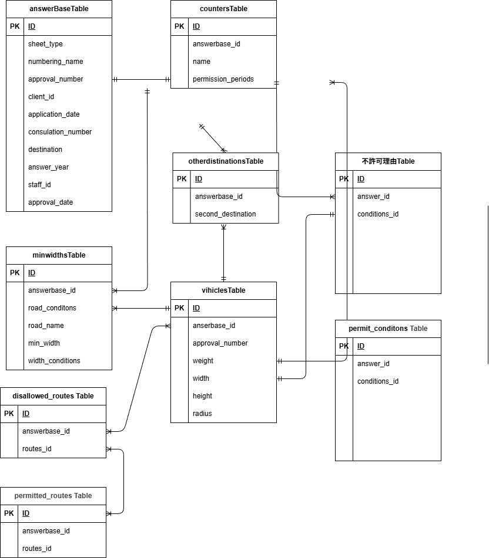

# Tokusha_app（特殊車両通行許可申請　回答書作成アプリ）

## 開発状況
2026/6/16現在
会員登録機能、ログイン機能、メール認証機能、印刷機能は未実装です。

##　環境構築
**Dockerビルド**
1. `git clone git@hub.com:onodera-j/Tokusha.git`
2. DockerDesktopアプリを立ち上げる
3. `docker-compose up -d --build`

> *MacのM1・M2チップのPCの場合、`no matching manifest for linux/arm64/v8 in the manifest list entries`のメッセージが表示されビルドができないことがあります。
エラーが発生する場合は、docker-compose.ymlファイルの「mysql」内に「platform」の項目を追加で記載してください*
``` bash
mysql:
    platform: linux/x86_64(この文追加)
    image: mysql:8.0.26
    environment:
      MYSQL_ROOT_PASSWORD: root
      MYSQL_DATABASE: laravel_db
      MYSQL_USER: laravel_user
      MYSQL_PASSWORD: laravel_pass
```

**Laravel環境構築**
1. `docker-compose exec php bash`
2. `composer install`
3. 「.env.example」ファイルを 「.env」ファイルに命名を変更。または、新しく.envファイルを作成
4. .envに以下の環境変数を修正または追加
``` text
DB_CONNECTION=mysql
DB_HOST=mysql
DB_PORT=3306
DB_DATABASE=laravel_db
DB_USERNAME=laravel_user
DB_PASSWORD=laravel_pass

5. アプリケーションキーの作成
``` bash
php artisan key:generate
```

6. マイグレーションの実行
``` bash
php artisan migrate
```

7. シーディングの実行
``` bash
php artisan db:seed
```

以下のデータを作成します
``` text
通行許可期間リスト（permission_periodsテーブル）
送り先リスト（clientsテーブル）
基本情報（answer_document_settingsテーブル）
担当者リスト(staff_membersテーブル)
登録路線リスト（route_categoriesテーブル、routesテーブル）
経路条件リスト（condition_categoriesテーブル、conditionsテーブル）
```

8. node起動(javascriptの動きを反映しながら動作確認)
```bash
docker exec -it app-node npm run dev
```

## 使用技術(実行環境)
- PHP8.3.29
- Laravel12.43.1
- MySQL8.0.44

## ER図


## URL
- 開発環境：http://localhost/
- phpMyAdmin：http://localhost:8080/
